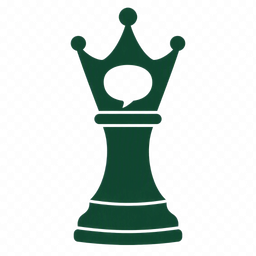

# FreeChessCoach

**A personal AI chess coach. Free, forever.** [freechesscoach.org](https://freechesscoach.org)

[](https://github.com/abrahamberg/FreeChessCoach/actions/workflows/ci.yml)

FreeChessCoach imports your games, runs them through a Stockfish + LLM analysis
pipeline, and then walks you through what actually happened — Socratically,
one position at a time — instead of just handing you a wall of engine
evaluations. It remembers what you're working on across sessions, so the
coaching compounds instead of resetting every game.

No subscription. No paywalled tiers. **Bring your own AI API key and it's
free, forever.**

## The model: bring your own key

Every LLM call costs someone money. Most "AI chess coach" products solve that
by putting you behind a subscription and marking up the API cost. FreeChessCoach
solves it differently: **you connect your own API-compatible provider**,
FreeChessCoach talks to it directly on your behalf, and you pay the provider
at cost — nothing added, nothing metered, nothing throttled. OpenAI Chat or
Responses and Anthropic Messages endpoints work, including compatible gateways
such as OpenRouter, Azure, Bedrock adapters, and self-hosted proxies.

The complete endpoint/model/key setup is encrypted with an unlock phrase that
only you know. The database never has enough information to decrypt it, and
the decrypted setup is kept only in a short-lived, encrypted Redis cache while
you are active. Locking or expiring the cache removes the key from the server.

That's the whole point: for anyone willing to paste in a key, coaching that
would otherwise cost a monthly fee costs whatever a handful of API calls cost
— usually cents.

That's the whole pitch: a genuinely good coach, not gated behind a business
model that needs you to keep paying whether you use it or not.

## How it works

1. **Sign in** with Google — no account form, no credit card.
2. **Import your games** from Lichess, or paste/upload a PGN.
3. **Analysis runs automatically** — Stockfish evaluates every position, and
   an LLM pass classifies moves (blunders, misses, brilliancies, best moves)
   and builds a per-game report: accuracy, phase-by-phase accuracy,
   opening/tactics/strategy/endgame scores, and an estimated rating.
4. **Talk through the game with your coach.** It asks Socratic questions
   before it tells you answers, grounds every claim in the engine evaluation,
   and picks up threads from past sessions instead of starting cold each time.
5. **Track progress over time** on your dashboard — focus areas the coach is
   actively working on with you, trends across games, and session history.

Pick from seven coach personas — same engine-grounded advice, different voice
and delivery, from a demanding drill-sergeant type to a warm, patient
explainer. Coaching sessions can be read or spoken aloud with in-browser
text-to-speech.

## Features

- **Engine-grounded, not vibes-based** — every claim about a position traces
  back to a Stockfish evaluation, not an LLM guessing at chess.
- **Socratic coaching** — the coach asks before it tells, so you build
  pattern recognition instead of memorizing one game's answers.
- **Full game reports** — accuracy, phase accuracy, opening/tactics/strategy/
  endgame scoring, move classification counts, estimated rating.
- **Persistent progress tracking** — focus areas and trends carry across
  sessions instead of resetting every game.
- **Lichess import or PGN upload/paste** — bring games from wherever you play.
- **Seven coach personas** — same method and honesty, different voice.
- **Voice coaching** — optional spoken delivery via in-browser TTS.
- **BYOK privacy** — use any compatible provider; the setup is encrypted with
  your phrase and disappears from the server after the short unlock window.

## Tech stack

FreeChessCoach is a TypeScript monorepo:

| Path                        | What it is                                                          |
| ---------------------------- | -------------------------------------------------------------------- |
| `apps/web`                  | React 19 + Vite SPA — the coaching UI                                |
| `apps/api`                  | Fastify 5 API + worker — routes, coach agent, LLM gateway, billing   |
| `services/engine`           | Standalone Stockfish/UCI HTTP microservice                           |
| `packages/chess-analysis`   | Pure chess logic — PGN parsing, move classification, position features |
| `packages/prompts`          | Coach system prompts and prompt builders                             |
| `packages/shared`           | Zod schemas shared across API and web                                |
| `deploy/helm`                | Kubernetes Helm chart for production deploy                          |

Coaching runs on the selected compatible endpoint via the Vercel AI SDK, with
Stockfish for engine truth, Postgres (Kysely) for storage, Redis for the
short-lived unlock cache, and graphile-worker for background analysis jobs.
It's bring-your-own-key only — no subscription, no platform-managed credits.

## Running it yourself

```bash
git clone https://github.com/abrahamberg/FreeChessCoach.git
cd FreeChessCoach
npm install
npm run dev        # full local stack via docker compose
```

See [`docs/dev-setup.md`](./docs/dev-setup.md) for environment variables,
auth modes, and single-workspace dev servers, and
[`docs/architecture.md`](./docs/architecture.md) for how the pieces fit
together.

## Contributing & growing the project

FreeChessCoach stays free because it's lean, not because it's funded — the
best way to help it grow is to use it, tell another chess player about it, or
open an issue with what's missing. Bug reports, feature ideas, and pull
requests are all welcome; see [`AGENTS.md`](./AGENTS.md) for the codebase's
conventions before sending a PR.

If FreeChessCoach helped your chess, a star on this repo helps other players
find it too.
